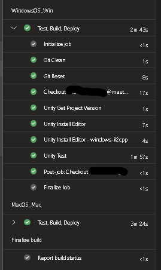

# Unity Tasks for Azure DevOps Pipelines

This collection of unity tasks adds CI/CD tooling for use in Azure Pipelines on Azure DevOps when working with [Unity](https://www.unity3d.com) projects.

Works for all Azure agents:

- Windows_NT
- Darwin
- Linux

The base commands execute using the [UnityHub](https://docs.unity3d.com/2020.1/Documentation/Manual/GettingStartedUnityHub.html) CLI and [UnityEditor CLI](https://docs.unity3d.com/Manual/CommandLineArguments.html). All Unity command variables can be found in the official documentation for your particular install.

If [code coverage](https://docs.unity3d.com/Packages/com.unity.testtools.codecoverage@1.2/manual/index.html) is installed in your project:
- The [EditorTest](Unity/Task_EditorTest.yaml) Task includes arguments for capturing the coverage results.
- [After](Unity/Tasks_SetupTestBuild.yaml) the tests are concluded:
  - The results will be [published](https://learn.microsoft.com/en-us/azure/devops/pipelines/tasks/reference/publish-test-results-v2).
  - The coverage will be [published](https://learn.microsoft.com/en-us/azure/devops/pipelines/tasks/reference/publish-code-coverage-results-v2).

# Get Started
Step 1: [Clone](https://learn.microsoft.com/en-us/azure/devops/repos/git/clone) this repo into your Azure project so you can reference it easily in your pipeline. You could optionally copy the files directly into your repository and skip Step 4.

Step 2: Install [UnityHub](https://docs.unity3d.com/2020.1/Documentation/Manual/GettingStartedInstallingHub.html) on your build agents

Step 3: Install [powershell](https://learn.microsoft.com/en-us/powershell/scripting/install/installing-powershell) on your build agents

Step 4: Import this repository as a [resource](https://learn.microsoft.com/en-us/azure/devops/pipelines/process/resources)

```
resources:
  repositories:
    - repository: templates
      type: git
      name: AzurePipelineUnityTasks
      ref: refs/heads/main
```

Step 5: Reference the templates by using the name of the resource repository 
- template: [Git/Task_Clean.yaml](Git/Task_Clean.yaml)@templates

(or without the @templates postfix if the files exist locally)

# Example
Example [pipeline](azure-pipelines.yml) using:
- [Git/Task_Clean.yaml](Git/Task_Clean.yaml)
- [Unity/Tasks_SetupTestBuild.yaml](Unity/Tasks_SetupTestBuild.yaml)
```
variables:
  projectPath: path/to/project
  buildName: NameOfMyGame

stages:
- stage: "WindowsOS_Win"
  dependsOn: []
  pool:
    name: Default
    demands:
    - Agent.OS -equals Windows_NT
  jobs:
  - job: Job_Unity
    displayName: "Test, Build, Deploy"
    timeoutInMinutes: 180
    steps:
      - template: Git/Task_Clean.yaml@templates
      - template: Git/Task_Reset.yaml@templates
      - checkout: self
        clean: false
        lfs: true
        fetchDepth: 0
        persistCredentials: true
      - template: Unity/Tasks_SetupTestBuild.yaml@templates
        parameters:
          os: win
          projectPath: ${{variables.projectPath}}
          shouldTest: true
          shouldBuild: true
          buildTarget: Win64
          buildOutputPath: $(Build.ArtifactStagingDirectory)
          buildName: ${{variables.buildName}}
          modules:
            - windows-il2cpp
```

